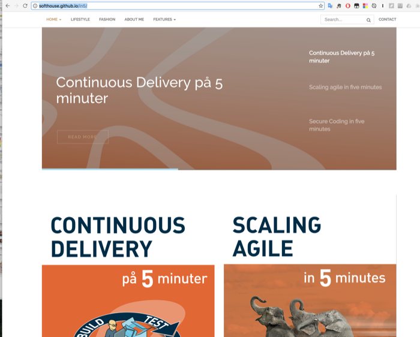

#Content as Code.
# Collaborate and focus on content

Magnus Siverbrant & Tom Mårdh

*2016-09-19*

<!-- slide -->

## We produce a lot of content!

<!-- slide -->

##Presentations

<!-- slide -->

<!-- slide -->

# Whats the problem with this content?

<!-- slide -->
## Currently

* No version control
* Content and presentation together
* Not so collaborative
* Unclear Ownership
* Not updated so frequently
* Hard to find.

<!-- slide -->

###Wouldn´t it be great if content could be handled more like code?

<!-- slide -->

### Hello Markdown!
    # Hello markdown!
    
    * point1
    * point2
    * point3

    Lorem ipsum dolor sit amet, ut labitur gloriatur eos, nostro definiebas 
    reprimique nec ea. Qui ei illum verear. Mei voluptatum appellantur id, 

    

<!-- slide -->

### Hello markdown!

* point1
* point2

Lorem ipsum dolor sit amet, ut labitur gloriatur eos, nostro definiebas 
reprimique nec ea. Qui ei illum verear. Mei voluptatum appellantur id, 
falli forensibus ne eum, sed eu dolores sapientem. At debet disputationi 

<!-- slide -->

<!-- slide -->

* Cheap/free hosting
* No DB
* Fast as lightning
* Version control content and presentation together
* Secure
* No php

<!-- slide -->

## Docpad

A dynamic static site generator based on node.js

<!-- slide -->

## github.com

<!-- slide -->

## github-pages

<!-- slide -->

## in5 get started

    npm install -g docpad@6.78
    npm install -g cake
    git clone https://github.com/Softhouse/in5.git
    cd in5
    ./setup
    docpad run 
    # Open a browser and go to http://localhost:9778/in5/

<!-- slide -->

## reveal.md 

<!-- slide -->
## Agenda

- Why use reveal-md?
- Markdown
- Reveal
- Installation
- Exercises
- Q&A

<!-- slide -->

### Why use reveal-md?

<!-- vertical -->

#### Elevator pitch

**revel-md** is a framework that presents slides.

Unlike Powerpoint or Keynote,

**reveal-md** lets you write in markdown and focus on content!

<!-- slide -->

### Markdown

<!-- vertical -->

#### Template

    # Title
    <!-- slide -->
    ## Agenda
    - Point 1
    - Point 2
    <!-- slide -->
    ### Point 1
    <!-- vertical -->
    #### Vertical Slide
    <!-- slide -->
    ### Point 2
    <!-- slide -->
    ## Thanks!

<!-- vertical -->

#### Comments on structure

Keeping the header levels helps in creating a PDF document

    <!-- slide --> insted of ---
    <!-- vertical --> insted of ----

Using these separators add only comments in the markdown

    Note followed by : before speker notes

<!-- vertical -->

#### [Markdown Cheat Sheet](markdown-cheatsheet-online.pdf)

<!-- slide -->

### Reveal

<!-- vertical -->

#### Different Variants

**reveal.js**

**reveal-md**

**revealGhPages**

What comes next?

Note:
Next
- Softhouse templates with all plugins enabled
- Softhouse template with color codes

<!-- vertical -->

#### [Reveal.js](https://github.com/hakimel/reveal.js)

**Pros**

- Competent
- The Look
- The Features

**Cons**

- Complex
- Lots of files

<!-- vertical -->

#### [Reveal-md](https://github.com/webpro/reveal-md)

**Pros**

- Markdown
- Let you focus on content
- Simplified editing
- Easy to get started

**Cons**

- Markdown
- Some things are tricky to accomplish

<!-- vertical -->

#### [revealGhPages](https://github.com/aln787/revealGhPages)

**Pros**

- Enables publishing with possibility to run presentation without any installation
- Same files can be used as with reveal-md

**Cons**

- A bit complicated setup

<!-- vertical -->

#### Presentation features

- **s** - speaker view
- **o** - overview
- **arrows** - navigate
- **b** - black screen

<!-- vertical -->

#### Advanced features

- Publish on github or any webserver with node
- Can use HTML and inline scripting
- Can use reveal.js functionality
- Remote presentations
- Plug-ins

<!-- slide -->

### Installation

<!-- vertical -->

#### Precondition

- [Node including npm](http://npm.com)
- [Git](http://git.com) (for Collaboration/versioning)

<!-- vertical -->

#### reveal-md installation

> npm install -g reveal-md

<!-- slide -->

### Exercises

<!-- vertical -->

#### reveal-md workflow

1. Create folder for the presentation
2. Create and edit markdown file
2. Start presentation

    `reveal-md file.md`

3. Preview slide show in browser

    http://localhost:1948

<!-- vertical -->

### Create Presentation

Create any presentation and be prepared to demo.

Use

- Slides
- Vertical slides
- Bullet points
- Pictures
- Links
- Speaker notes
- ...

<!-- vertical -->

### Publish Presentation

<!-- slide -->

### Thanks!

Q&A

<!-- vertical -->

#### References

- [Reveal.js](https://github.com/hakimel/reveal.js)
- [Reveal-md](https://github.com/webpro/reveal-md)
- [revealGhPages](https://github.com/aln787/revealGhPages)
- [Node including npm](http://npm.com)
- [Git](http://git.com)
