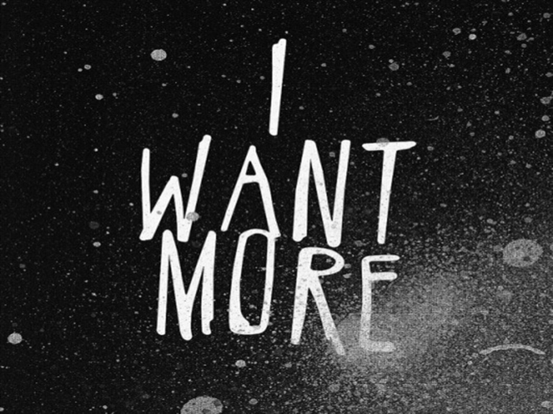
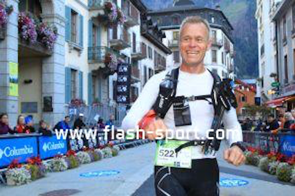
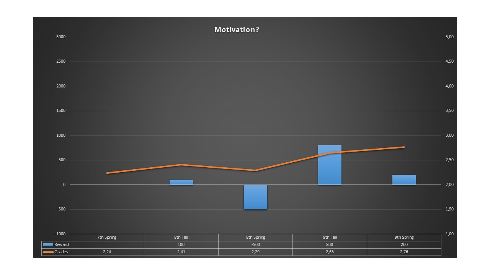
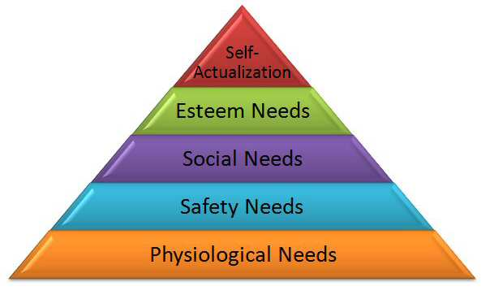
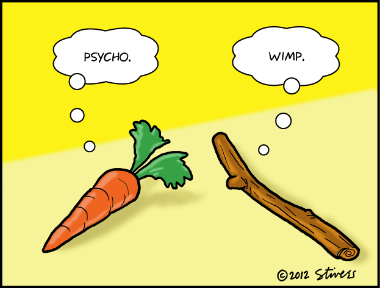
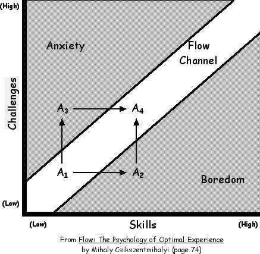
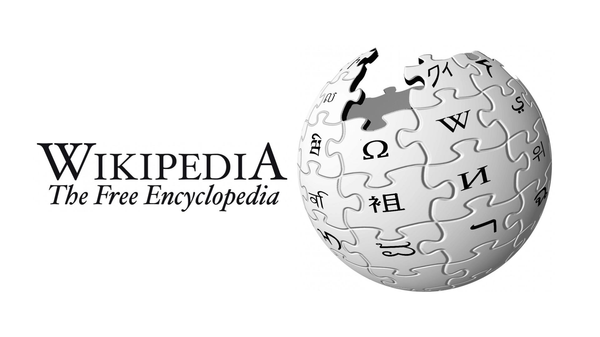

Stefan Claesson/Jonas Jaconelli

Note:

This speech is about motivation, built mainly on "Drive - The surprising truth about what motivates us" by Daniel H Pink from 2009.

---

<iframe width="1176" height="661" src="Motivation-PianoStairs.mp4" frameborder="0" allowfullscreen></iframe>

---

# Motivation

 * Extrinsic
 * Intrinsic

Note:

E - Rewards, NOT punished       
I - Because I WANT to         
Film - INTRINSIC

---

Note:
I'm an ultra runner. Sometimes I go running for very long times.
Took me more than 23h to finish.
What motivates me to participate in races >20h?
INTRINSIC

---

Note:
Try making someone do something? Mow the lawn, wash the car?
Reasonably gifted, quite easy to learn, not motivated to study.
I tried offering money for better grades €2000.
EXTRINSIC

- Increasing obesity among children
- Swedish gov - thorough investigation
- Little exercise - much sugar
- Legislation for more physical activity in school
- Sugar tax (added benefit of more gov income)
- Now the market has partly solved the problem for us!

---

Note:
Sugar tax (punishment) - EXTRINSIC
PokemonGo - INTRINSIC

---

## Motivation 1.0

Note:
Basic needs
- In humankind’s childhood,
- Mainly about survival
- Hunger,
- Thirst,
- Sex

---

## Motivation 2.0

Note:
Rewards and punishments - reward desired behav. punish undesired - 1911 FW Taylor - Sc Mngmnt - Efficiency, 100% utility - 
*Can* work with rule-based routine tasks - Often contradictory applied to creative tasks

Regression toward the mean - Israeli fighter pilots

---

## Motivation 2.0
## Problems

Note:
- Encourage unethical behaviour,
- Extinguish intrinsic motivation,
 - Paid to make drawing
- Diminish performance,
- Crush creativity,
- Create addictions,
- Crowd out good behaviour and
- Foster short-term thinking
 - Companies with bonuses

---

## Motivation 2.0
## When?
 
Note:
If you need routine tasks done, like shifting a pile of dirt from one place to another, it *might* help doing the following: 
- Offer rationale for why necessary
- Acknowledge that the task is boring
- Allow to complete their own way

So what does work?
 
---
 
## Motivation 3.0

Note:
- Mastery
- Autonomy
- Purpose

---

## Mastery

Note:
Mastery - better at somthng that matters
- begins with "flow", optimal experiences when the challenges are matched with our abilities
EX. teacher giving student too easy task
- Mindset - abilities are infinitely improvable
- Pain - effort, grit & deliberate practice
- Asymptote - never be fully realised

---

## Autonomy

Note:
Autonomy - the wish to be autonomous and self-directed
- task - what
- time - when
- team - with whom
- technique - how

---

## Purpose

Note:

Purpose - the wish to be part of something that is larger than oneself

---

## Take away

 > If you really want to motivate someone - don't be lazy and offer money! Find their "inner" motivation!

---

## Literature:

| Title                                                                                 | Author                   | Year |
| ------------------------------------------------------------------------------------- | ------------------------ | ---- |
| Drive - The surprising truth about what motivates us                                  | Daniel H Pink            | 2009 |
| Flow                                                                                  | Mihaly Csikszentmihalyi  | 1990 |
| Management 3.0                                                                        | Jurgen Appelo            | 2011 |
| Thinking fast and slow                                                                | Daniel Kahneman          | 2011 |
| The Principles of Scientific Management                                               | Frederick Winslow Taylor | 1911 |
| Who Am I? The 16 basic desires that motivate our actions and define our personalities | Steven Reiss             | 2002 |

