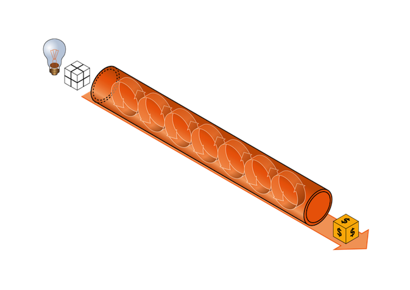
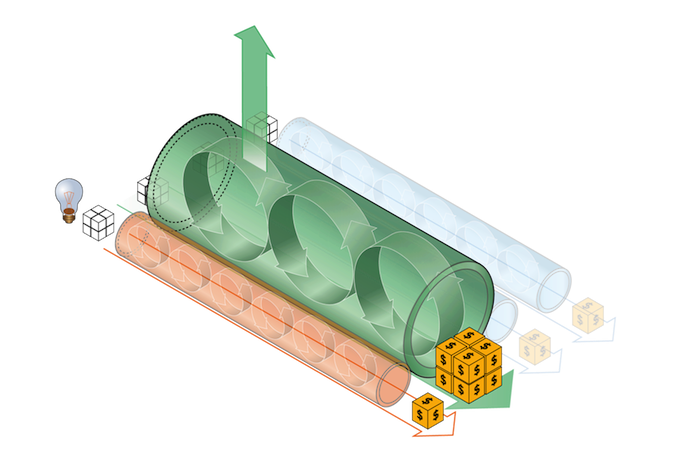
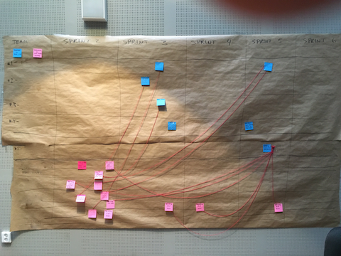

# Skala Agilt Arbete i Praktiken

Dokumentation från seminarium

- Göteborg, 2016-03-15
- Malmö och Lund, 2016-03-16

Tom Mårdh, Softhouse Consulting

[tom.mardh@softhouse.se](mail://tom.mardh@softhouse.se) / @tommardh 

<!-- slide -->

## Agenda

1. Softhouse Scaling Agile Model
1. Praktiska erfarenheter
1. Nyheter i SAFe 4.0

<!-- slide -->

## Skala Agilt Arbete

**Varför?**

- +400 personer
- Få med sig positiva effekter från Agilt i ett Team
- Hitta fungerande interface mot en icke-agil omgivning
- Producera mycket på kort tid
- Många tem med beroenden
- Erfarenhet från litet projekt till stort
- Ökat värde genom flera team
- Röd tråd i tankesättet
- Uppföljning på program/portföljnivå

Note: Från Flipcharts i Göteborg, Malmö respektive Lund - Anledningar till att skala agilt arbete.

<!-- vertical -->

## Softhouse Scaling Agile Model 

<!-- vertical -->

## Värdeström

<!-- vertical -->

## Erbjudanden

<!-- vertical -->

## Storlek

<!-- vertical -->

## Ramverk

- DaD - Disciplined agile Development
- LeSS - Large Scale Scrum
- Nexus - Scrum.org
- SAFe - Scaled Agile Framework
- ...

ASK Matrix

[http://www.agilescaling.org/ask-matrix.html](http://www.agilescaling.org/ask-matrix.html)

Note: Vilka ramverk känner ni till eller har hört talas om?

<!-- slide -->

## Praktiska erfarenheter

- Värdeström och kravstruktur
- Releaseplanering i SAFe

<!-- vertical -->

## Värdeström och kravstruktur

- Verksamhetsorienterat (CR)
- Teamorienterat (Stories)
- Aktivitetsorienterat (Aktiviteter)

Note: Detta är ej kopplat till någon speciell metod. Flipchart för att skapa överblick.

<!-- vertical -->

## Releaseplanering i SAFe

- Anpassning av Agenda
- Program Board
- Förberedelser
- Teamorganisation
- Scrum of Scrums
- Krypa - Gå - Springa

Note: i SAFe version 4.0 heter detta PI Planning

<!-- vertical -->

## Anpassning av Agenda

För information om Realease Planning inklusive standard agenda

[http://v3.scaledagileframework.com/release-planning/](http://v3.scaledagileframework.com/release-planning/)

<!-- vertical -->

##Program Board

<!-- vertical -->

## Förberedelser

- Krav
- Intressenter

<!-- vertical -->

## Teamorganisation

- Feature Teams
- Component Teams
- X-Functional Teams
- Scrum Team
- Externa Team

<!-- vertical -->

## Program Board

<!-- vertical -->

## Scrum of Scrums

<!-- vertical -->

## Förhållningssätt till implementation

- Krypa
- Gå 
- Springa

<!-- slide -->

## Nyheter i SAFe 4.0

SAFe 4.0 for Lean Software and Systems Engineering

- Big Picture
- SAFe Values
- Value Stream
- Kanban

<!-- vertical -->

## SAFe 3.0 Big Picture

Länk till SAFe 3.0

[http://v3.scaledagileframework.com/](http://v3.scaledagileframework.com/)

<!-- vertical -->

## SAFe 4.0 Big Picture

Länk till SAFe 4.0

[http://scaledagileframework.com/](http://scaledagileframework.com/)

<!-- vertical -->

## SAFe Values

- Alignment
- **Built-in Quality**
- Transparency
- Program Execution

<!-- vertical -->

## Value Stream

- Organisera runt värdeström
- Operational Value Stream
- Development Value Stream
- Budgetering 

<!-- slide -->

# Tack!

### Frågor?

Tom Mårdh, Softhouse Consulting 

[tom.mardh@softhouse.se](mail://tom.mardh@softhouse.se) / @tommardh

