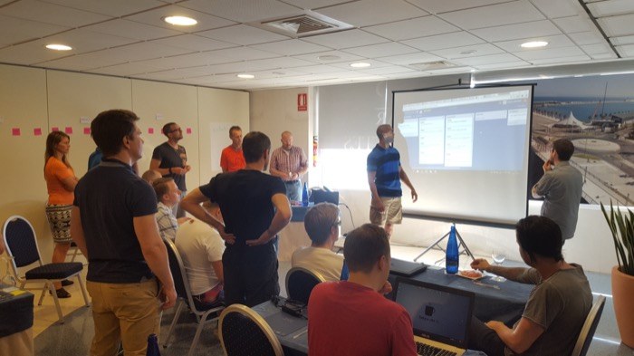

## Oh happy day

Magnus Siverbrant
Tom Mårdh

---

## It started in Alicante.

* 1 day
* 15 ish developers
* 4 Coaches
* 1 Idea
* A platform known only by 1 developer
* 3 sprints

---

## Sounds like a bullet proof plan? Right!

---

## It would be fun do this @ a customer!

---

# Bea had a team for us!

---

## About the team

* 15 ish people in 5 locations
* Developing native apps for three platforms
* Failed Outsourced project brought in for rescue.
* Complex legacy backend
* Challenges to get things done.
* No real team spirit

---

## The setup

** day 1 **

* Primer 60 minutes
* Pressentation of story to work on and discussions on how to work 30 minutes 

** Day 2 **

    for( i=1;i<=3;i++){
        planning (10);
        sprint (90);
        demo(10);
        retro(5);
        fika(5);
     }

** Day 3 **

* Debriefing/Retro 30 minutes
* Whats next. 60 minutes

---

## Primer highlights
* You have chosen to have the problems you have!
* Agile mindset
* Mob programming
* What is the sound of one hand clapping.
* economics of iterative development

---

## Sprint 1

" What should I do all day?  Backend  things are already done."
  
Note:
* " What should i do backend  things are allready done "  
* " but im the only Android developer "  
* nothing to show on Windows mobile.  
* UX noticed a flaw in the design.  
* the backend wasn´t done.  

---

## Sprint 2

" I now realize that Questions are not interuptions when in context"  

Note:
* A lot of interesting discussions between different fractions of the team  
* " I now realize that Questions are not interuptions when in context"  
* " All developers have a shared understanding of this feature and it will be easier maintain / add to it later"  
* One iOS developer pairs with the Android developer.  
* Still no demo from the windows guys.  
* Still problems with the backend.  
* "How can we involve the testers earlier?"  

---

## Sprint 3

Focus on really getting things done is emerging. 

Note:
* Subteams disolve and people start to help each other out.   
* Focus on really getting things done is emerging.  
* Problem with backend finally solved for Windows.  
* We decide to move demo untill the next morning to get 15minutes more development  

---

## Retro

" It felt frustrating to not have something to do all the time"  
" It felt like we got so much done" (same person)  

Note:
 Happy faces  
 " how do we work like this in our everyday work?"  
 " it felt frustrating to not have something too do all the time "  
 " it felt like we got so much done" (same person)  
 " Can we arrange an open hangout/skype session between the different sites "  
 " It was great to see the creaticity and the flow of energy in the room"

---

## Two months later.

" We call it happy days"  

Note:
* " The workshop really opened us up to new ideas"  
* " We try to work like this 2 days a week"  
* " We call it happy days"  
* " Throughput has gone up significantly "  

